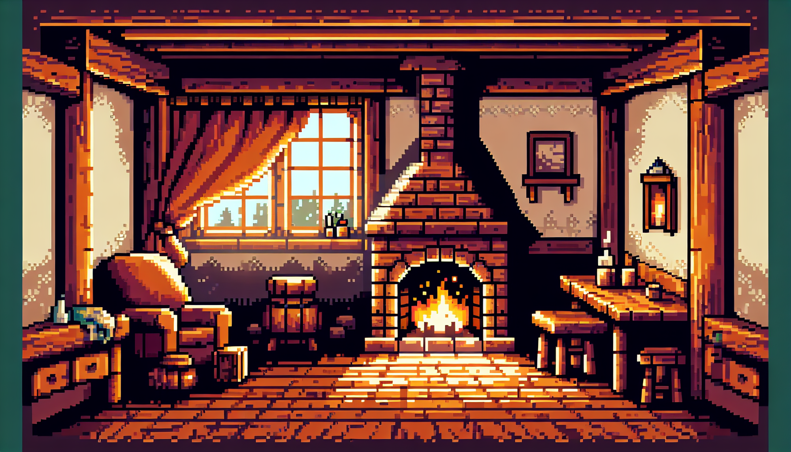

# 🎨 Art of Focus

A productivity RPG that transforms your real-world focus sessions into a rewarding pixel-art game experience. Built with Next.js, React, TypeScript, and Tailwind CSS.



## 🎮 Features

### Core Gameplay
- **Focus Sessions**: Customizable timer (15/25/45/60/90/120 minutes)
- **Activity Tracking**: Work, Study, Creative, Exercise, Reading, Meditation
- **XP System**: Gain experience based on session duration
- **Loot Drops**: Earn items, gear, and consumables
- **Streak System**: Maintain daily streaks for bonus XP

### Character Progression
- **Level Up**: Gain levels through focus XP
- **Equipment**: Equip weapons, armor, and accessories
- **Permanent Bonuses**: XP boosts, loot chance increases
- **Stats**: HP, Attack, Defense, Speed

### Hall System
- **5 Unlockable Rooms**: Library, Treasury, Meditation Garden, Forge, Observatory
- **Decorations**: Rare permanent items that provide bonuses
- **Room Bonuses**: +XP%, +Loot%, +Stamina, +Drop Rates

### Item System
- **Weapons**: Boost XP gain, attack stats
- **Gear**: Helmets, armor, rings with various bonuses
- **Consumables**: Coffee, potions, scrolls with temporary effects
- **Decor**: Permanent hall decorations (rare drops)

### Penalty System
- **Quit Early**: No loot, XP loss (scaled by % completed)
- **Break Streak**: Quitting resets your daily streak
- **Fair Mechanics**: Rewards consistency, discourages quitting

## 🛠️ Tech Stack

- **Framework**: Next.js 16 (App Router)
- **Language**: TypeScript
- **Styling**: Tailwind CSS
- **State Management**: React Context + useReducer
- **Storage**: LocalStorage (persistent saves)
- **Assets**: AI-generated pixel art

## 📁 Project Structure

```
src/
├── app/                 # Next.js app routes
│   ├── globals.css     # Global styles
│   ├── layout.tsx      # Root layout with GameProvider
│   └── page.tsx        # Main game page
├── components/          # React components
│   ├── FocusTimer.tsx  # Timer + session management
│   ├── CharacterPanel.tsx  # Stats + equipment
│   ├── Inventory.tsx   # Item management
│   └── HallPanel.tsx   # Hall decoration
├── context/
│   └── GameContext.tsx # Game state + logic
├── types/
│   └── game.ts         # TypeScript types
public/
└── assets/             # Pixel art assets
```

## 🚀 Getting Started

### Prerequisites
- Node.js 18+
- npm or yarn

### Installation

```bash
# Clone the repository
git clone <repo-url>
cd art-of-focus-app

# Install dependencies
npm install

# Run development server
npm run dev

# Open http://localhost:3000
```

### Build for Production

```bash
npm run build
```

The static site will be in the `dist/` folder.

## 🎨 Asset Generation

Pixel art assets are generated using DALL-E 3 with consistent prompts:

```
"Pixel art [ITEM], 32x32, [RARITY] tier, 
limited palette, black outline 1px, 
no anti-aliasing, white background, 
game [TYPE] sprite"
```

### Current Assets
- Character sprites
- Weapons (staff, sword)
- Gear (helmet, ring)
- Consumables (coffee, potions, scrolls)
- Decor (bookshelf)
- Environment (cozy cottage)

## 📱 Mobile Support

The app is fully responsive and works on mobile devices:
- Touch-friendly interface
- Bottom navigation bar
- Responsive grid layouts
- PWA-ready (can be installed to home screen)

## 🎯 Game Balance

### XP Formula
```
Base XP = Session Duration (minutes)
Streak Bonus = 1 + (Streak Days × 0.1)
Equipment Bonus = Sum of all +XP% items
Total XP = Base × Streak × (1 + Equipment/100)
```

### Loot Drop Rates
- Common: 70%
- Rare: 20%
- Epic: 8%
- Legendary: 2%

(Bonuses increase rare+ drop rates)

### Quit Penalties
- 0-24%: -100 XP, streak broken
- 25-49%: -75 XP, streak at risk
- 50-74%: -50 XP
- 75-89%: -25 XP
- 90-99%: -10 XP

## 🔮 Future Features

- [ ] Sound effects and music
- [ ] Push notifications
- [ ] Social features (friends, guilds)
- [ ] More environments
- [ ] Achievement system
- [ ] Cloud sync
- [ ] Mobile app (React Native)

## 📄 License

MIT License - feel free to use and modify!

## 🙏 Credits

- Pixel art: Generated with OpenAI DALL-E 3
- Icons: Emoji
- Framework: Next.js + Vercel

---

**Transform your focus into power.** 🎮✨
